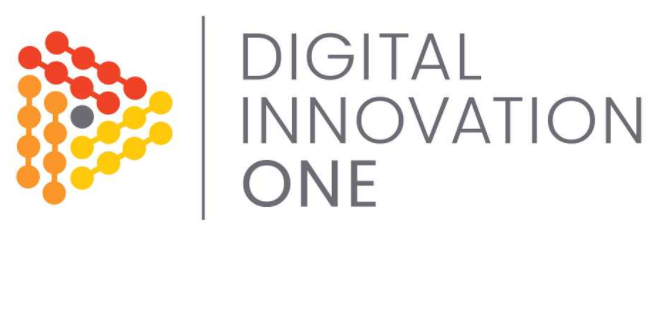
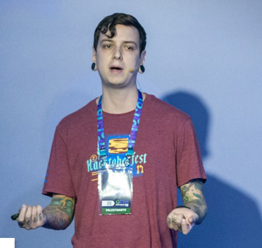

## ❔ Sobre o Projeto
Durante o bootcamp da DigitalInovationOne foi desenvolvido um game carinhosamente chamado de Dino-Game. Ele é inspirado no **ET-Rex Game**, um jogo integrado ao navegador Google Chrome criado por Sebastien Gabriel em 2014 e pode ser principalmente acessado pressionando a barra de espaço quando estiver offline no Google Chrome.

## 🧐 Motivo
Desenvolvimento do projeto Dino-Game realizado durante o bootcamp da Digital Inovation One.

## 📸 Screenshots


*Tela Inicial*


## ⚙ Instalação  
se quiser baixar e rodar na sua máquina, clone o repositório comgit clone 
clone ```https://github.com/IsraelJulio/Game-DinoChrome.git```

E acesse o arquivo index.html no seu navegador favorito!

## Improvements
Para se Destacar da versão do projeto proposto no curso, uma tela final foi adicionada ao game, além do sistema de pontuação que não existia no projeto inicial


## 🐛 Issues
Sinta-se à vontade para registrar um novo problema com o respectivo título e descrição no repositório. Se você já encontrou uma solução para seu problema, adoraria revisar sua solicitação de pull!

## 🤝 Contribuições
Siga os passos abaixo para contribuir:

1. Faça o *fork* do projeto (<https://github.com/IsraelJulio/Game-DinoChrome.git>)

2. Clone o seu *fork* para sua maquína (`git clone https://github.com/user_name/REPO_NAME.git`)

3. Crie uma *branch* para realizar sua modificação (`git checkout -b feature/name_new_feature`)

4. Adicione suas modificações e faça o *commit* (`git commit -m "Descreva sua modificação"`)

5. *Push* (`git push origin feature/name_new_feature`)

6. Crie um novo *Pull Request*

7. Pronto, agora só aguardar a análise 

# Agradecimentos

<div align=center>
  <table style="width:100%">
    <tr align=center>
      <th><strong>Digital Inovation One</strong></th>
      <th><strong>Celso Henrique</strong></th>
    </tr>
    <tr align=center>
      <td>
          
      </td>
      <td>
          
      </td>
    </tr>
  </table>
</div>

## 📜 License

O projeto lançado em 2022 sobre a licença [MIT](./LICENSE) ❤️ 

Made with ♥ by Israel Julio

Gostou? Deixe uma estrelinha para ajudar o projeto ⭐
